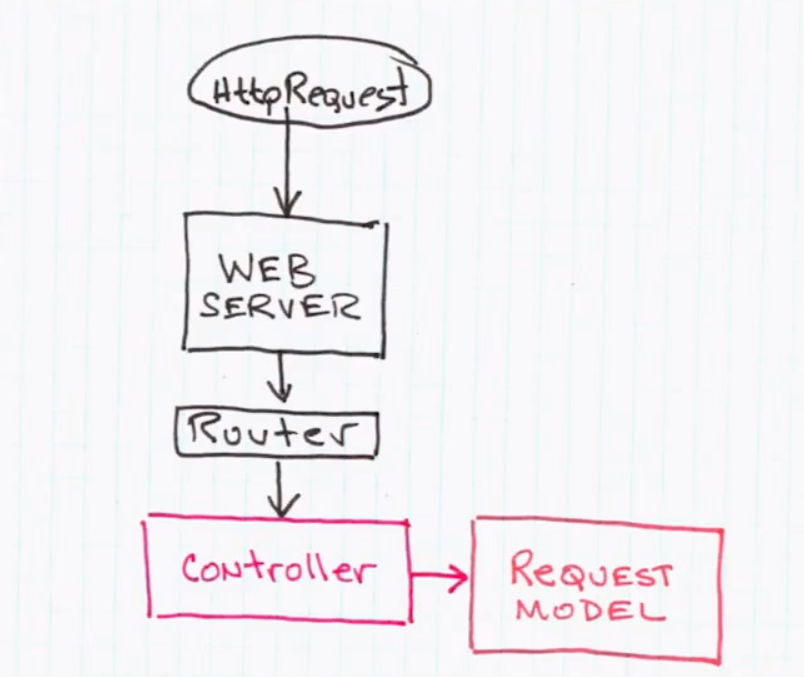

Clean Architecture
---

## Video

<iframe width="560" height="315" src="//www.youtube.com/embed/WpkDN78P884" frameborder="0" allowfullscreen="allowfullscreen"> </iframe>

## Flow of Information

User executes a request/command and the **delivery mechanism** creates a new **Request Model** which pushes it through the boundaries.

This means that in an **MVC environment** we'd have some web mechanism which instantiates the controller which in turn instantiates the Request Model.

As mentioned, it would then pass it on through the **Boundaries** (having an interface of it) into the **Interactors** (the core part of the application).

Zooming into that scenario we'd have

The Interactors **interact** with the Request Model by means of the **Application Business Rules** and adapt it using the **Entities** which contain the **high level Enterprise Rules**. Out of that we get a **ResultModel** which is _pushed back_ through the boundaries using an "out-bound" boundary which has been injected as an interface to the Interactors. 

## The Whole

## Database

Database should not be in the middle, but rather a plugin that provides persistent storage. This allows to leave it away when not needed (i.e. unit tests) or easily exchange it with some alternative storage mechanism.

## References

- http://www.infoq.com/news/2013/07/architecture_intent_frameworks
- http://blog.8thlight.com/uncle-bob/2012/08/13/the-clean-architecture.html
- http://jeffreypalermo.com/blog/the-onion-architecture-part-1/
- [Keynote: Architecture the Lost Years](http://www.youtube.com/watch?feature=player_detailpage&v=WpkDN78P884#t=1672s)