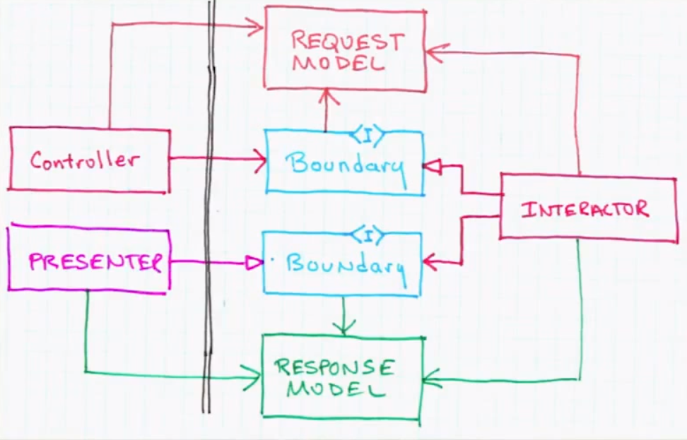

Clean Architecture
---

This is my playground on trying to implement Uncle Bob's description of a so-called [Clean Architecture](http://blog.8thlight.com/uncle-bob/2012/08/13/the-clean-architecture.html) which he also mentions in his keynote about "Architecture the Lost Years".

<iframe width="560" height="315" src="http://www.youtube.com/embed/WpkDN78P884" frameborder="0" allowfullscreen="allowfullscreen"> </iframe>

The implementation happens to be in C# .Net using WebApi as the Frontend (or Delivery Mechanism as Uncle Bob calls it). However you should equally be able to prot this to any desired language.

### State

This is in a very early state. That's also the reason why it isn't in a separate GitHub project but under a folder of my "Codehacks" repository I use for open experiments.

### Contributions

Contributions are always welcome. Feel free to submit pull request or simply open any issues which could be used for an open discussion.

### Disclaimer

All of the pictures used here are from the Uncle Bob's keynote (basically nothing than screenshots) to visually evidence the different parts of the architecture he describes.

# The Architecture

From here onwards I collect some notes from the keynote, just to have them in one place to keep the big picture.

## Flow of Information

User executes a request/command and the **delivery mechanism** creates a new **Request Model** which pushes it through the boundaries.

This means that in an **MVC environment** we'd have some web mechanism which instantiates the controller which in turn instantiates the Request Model.

As mentioned, it would then pass it on through the **Boundaries** (having an interface of it) into the **Interactors** (the core part of the application).

Zooming into that scenario we'd have

The Interactors **interact** with the Request Model by means of the **Application Business Rules** and adapt it using the **Entities** which contain the **high level Enterprise Rules**. Out of that we get a **ResultModel** which is _pushed back_ through the boundaries using an "out-bound" boundary which has been injected as an interface to the Interactors. 

## The Whole

## Database

Database should not be in the middle, but rather a plugin that provides persistent storage. This allows to leave it away when not needed (i.e. unit tests) or easily exchange it with some alternative storage mechanism.

# Open Questions

## The MVC Controller implements a Boundary?

Thinking of a desktop environment where I use an MVC/MVP/MVVM pattern (whatever), I might have a controller/presenter/viewmodel that implements the Boundary and as a consequence, an Interactor might call a method on that Boundary to display something to the UI.

I'm thinking of something like (abstract code)

	class OrderPresenter : IOrderOutputGateway {

		public void DisplayOrder(OrderResultModel model) {
			//do some transformation and display it on the corresponding
			//textboxes etc...
		}

	}

and in turn the `PlaceOrder` Interactor might look like

	class PlaceOrder : IPlaceOrderInteractor {

		public PlaceOrder(IOrderOutputGateway outputGateway) {
			this.outputGateway = ....
		}

		public void PlaceOrder(OrderRequestModel model) {

			//1. apply your business logic and transformations
			//2. construct the OrderResultModel
			//3. invoke the outputGateway to display your results

			outputGateway.DisplayOrder(orderResultModel);
		}

	}

Finally, my questions.

**In a web environment, where I have a REST web api, how would that interaction work??**

Usually the methods are there similar to (obviously slight changes depending on what your frontend framework offers you)

	public class OrdersController {

		public void PlaceOrder(Request request, Response response) {

			//1. parse out the data from the request constructing the OrderRequestModel
			//2. Invoke the PlaceOrder Interactor
			//3. ?? 

		}

	}

Point 3?? I would expect to get the `OrderResultModel` directly as a result from the Interactor which I then transform s.t. it is suitable for being returned in the response. That looks fine to me, however I'm not sure whether that would violate the principles mentioned by Uncle Bob.  
(IMHO it wouldn't as long as I do not create dependencies outwards)

# References

- http://www.infoq.com/news/2013/07/architecture_intent_frameworks
- http://blog.8thlight.com/uncle-bob/2012/08/13/the-clean-architecture.html
- http://jeffreypalermo.com/blog/the-onion-architecture-part-1/
- [Keynote: Architecture the Lost Years](http://www.youtube.com/watch?feature=player_detailpage&v=WpkDN78P884#t=1672s)